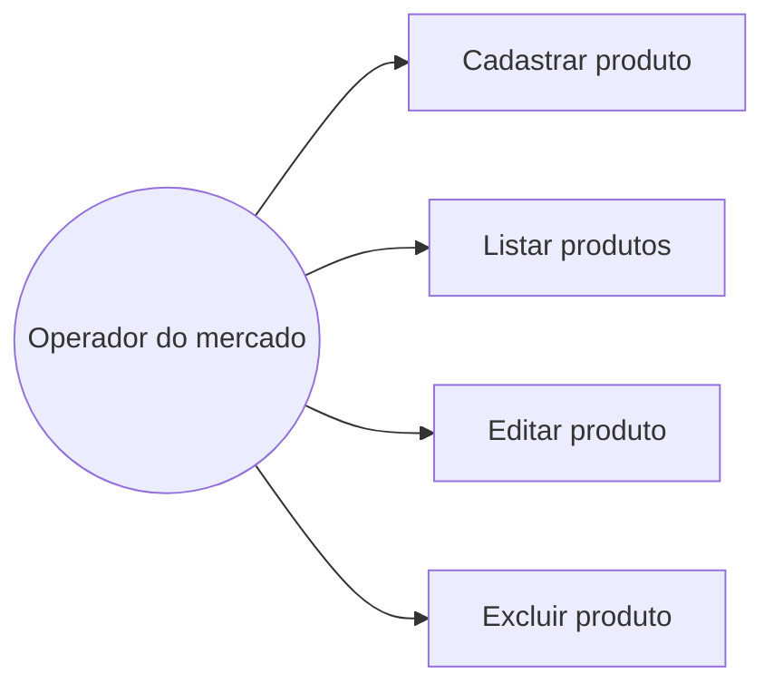

# Documentação de Caso de Uso

## Ator

- **Operador do mercado:** pessoa responsável por manter os dados dos produtos e acompanhar o estoque.

## Ações disponíveis

- Cadastrar produto informando nome, categoria, descrição, preço, quantidade e validade.
- Listar e visualizar os produtos cadastrados.
- Editar os dados de um produto existente.
- Excluir um produto após confirmar a ação.

## Diagrama

## Fluxo resumido

| Caso de uso | Resultado esperado |
| --- | --- |
| Cadastrar produto | O sistema valida os campos e grava o novo produto no banco. |
| Listar produtos | O sistema exibe os produtos cadastrados e seus dados principais. |
| Editar produto | O sistema valida e salva as alterações do produto escolhido. |
| Excluir produto | Após a confirmação, o sistema remove o produto escolhido. |